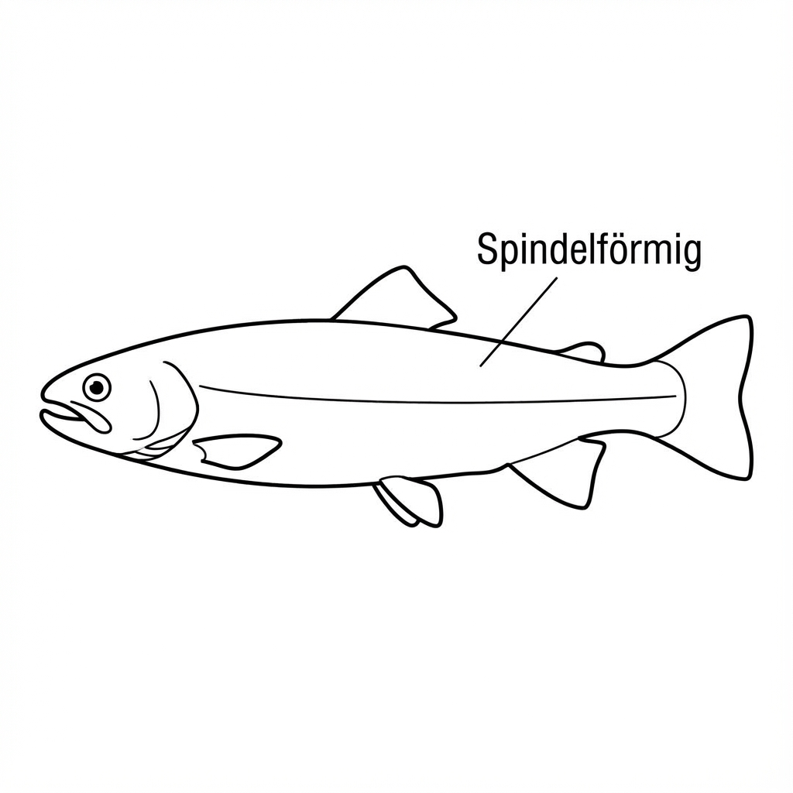
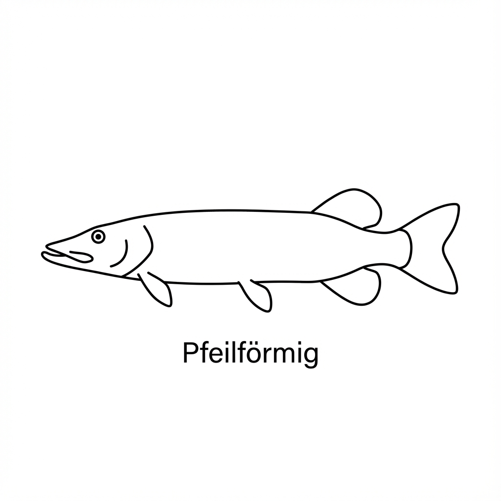
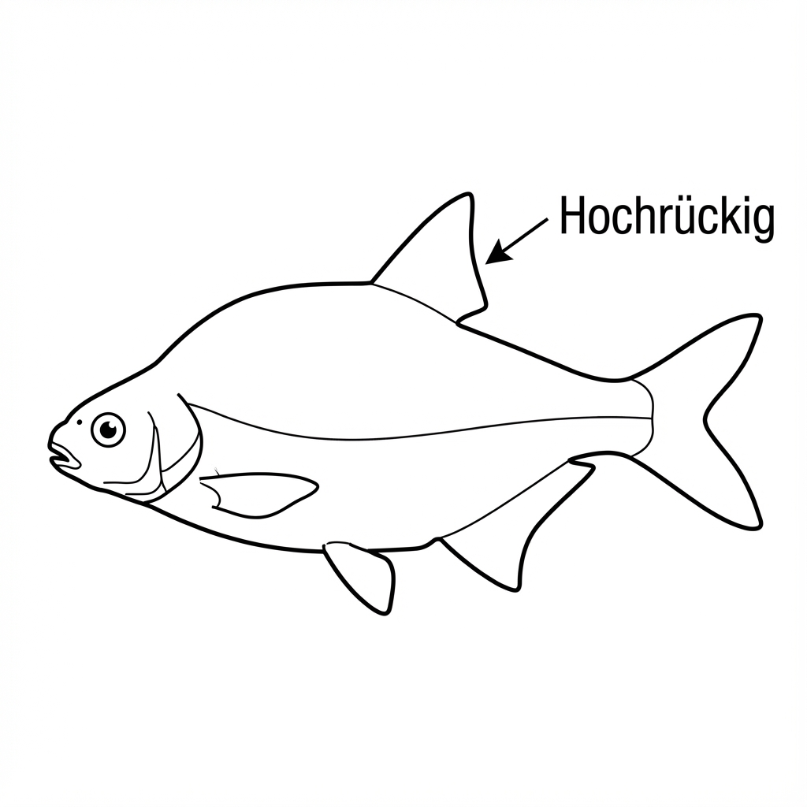
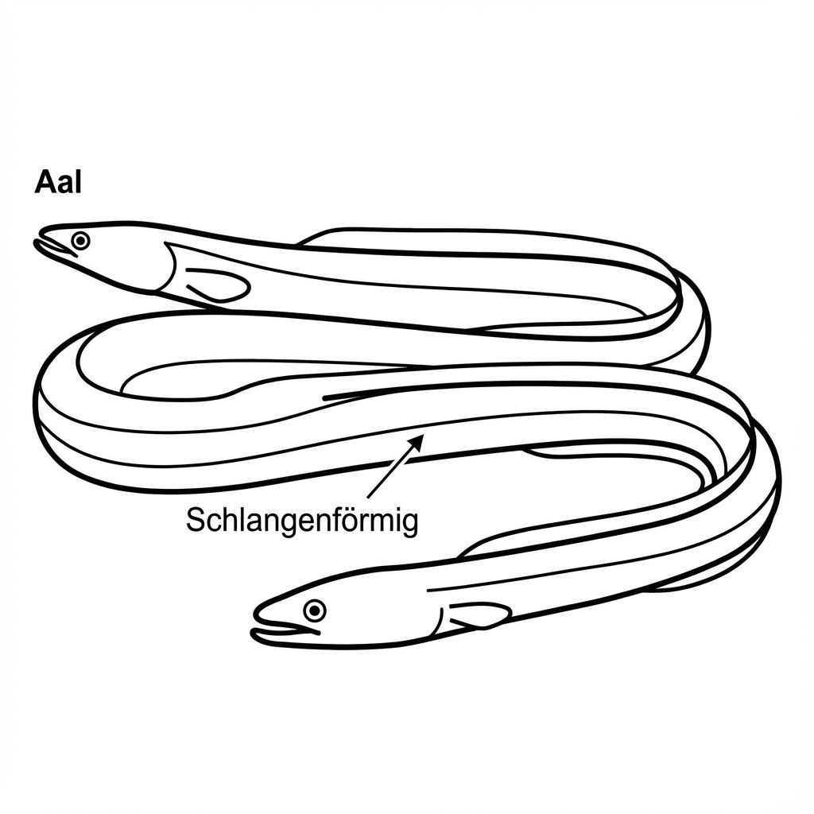
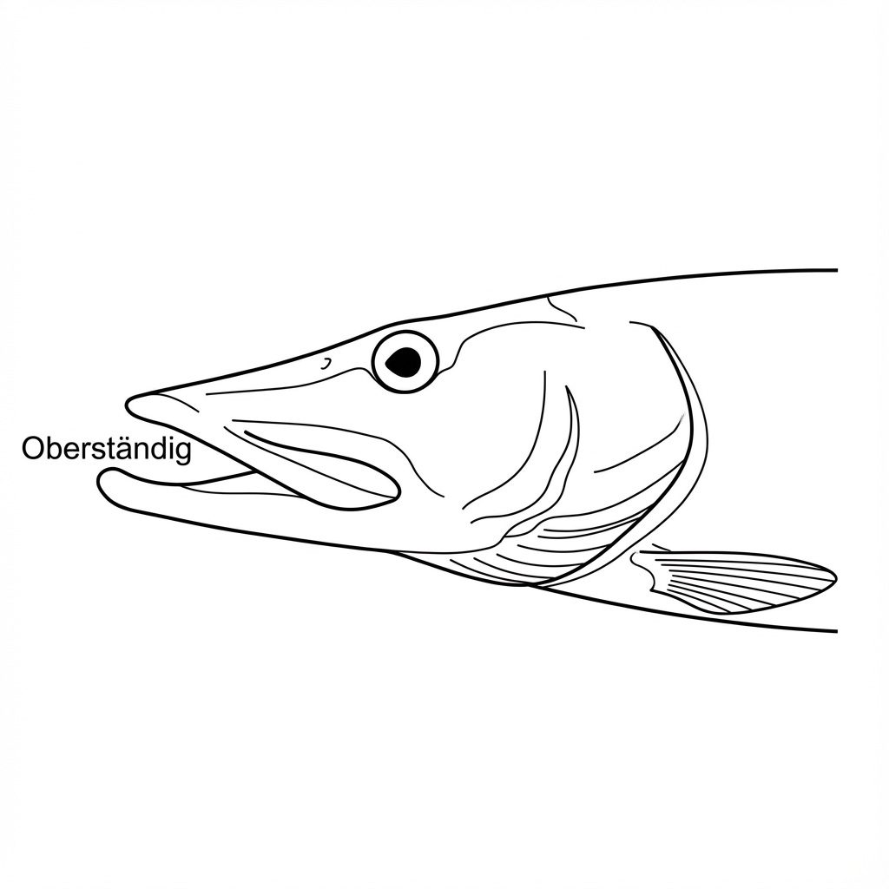
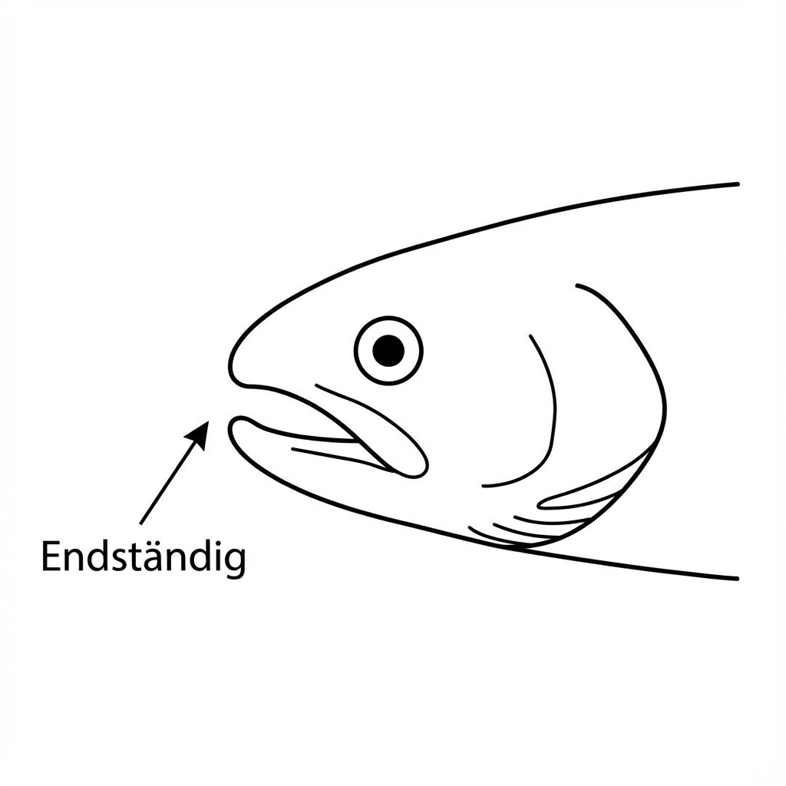
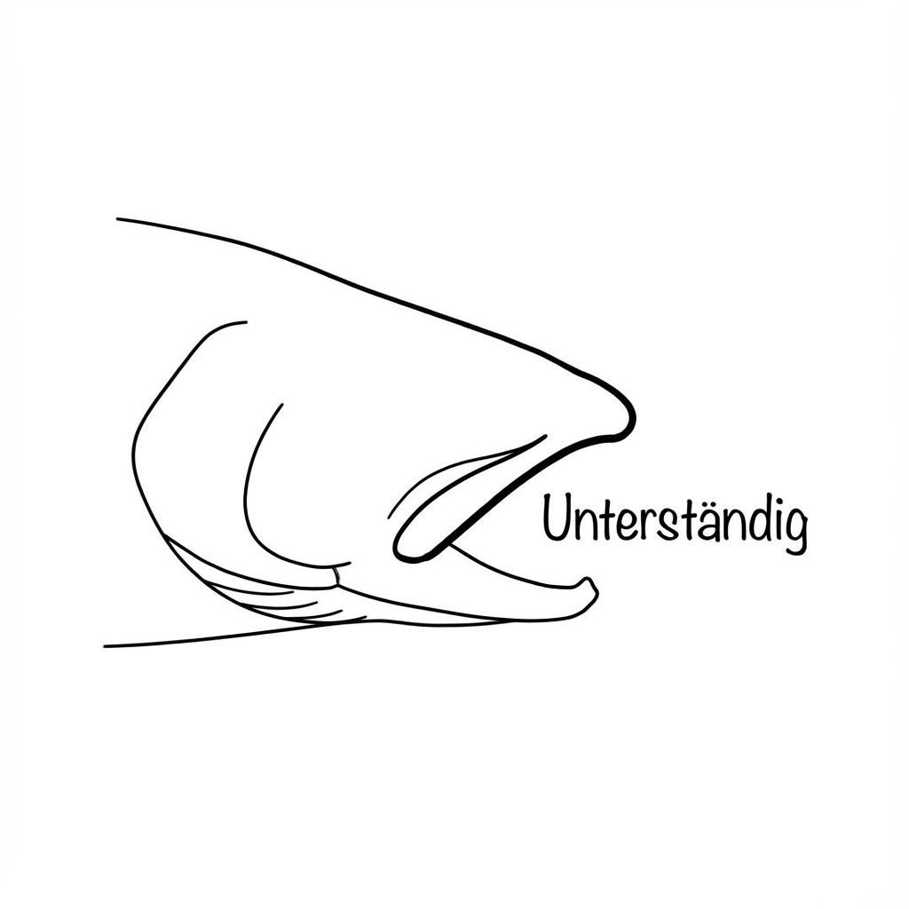
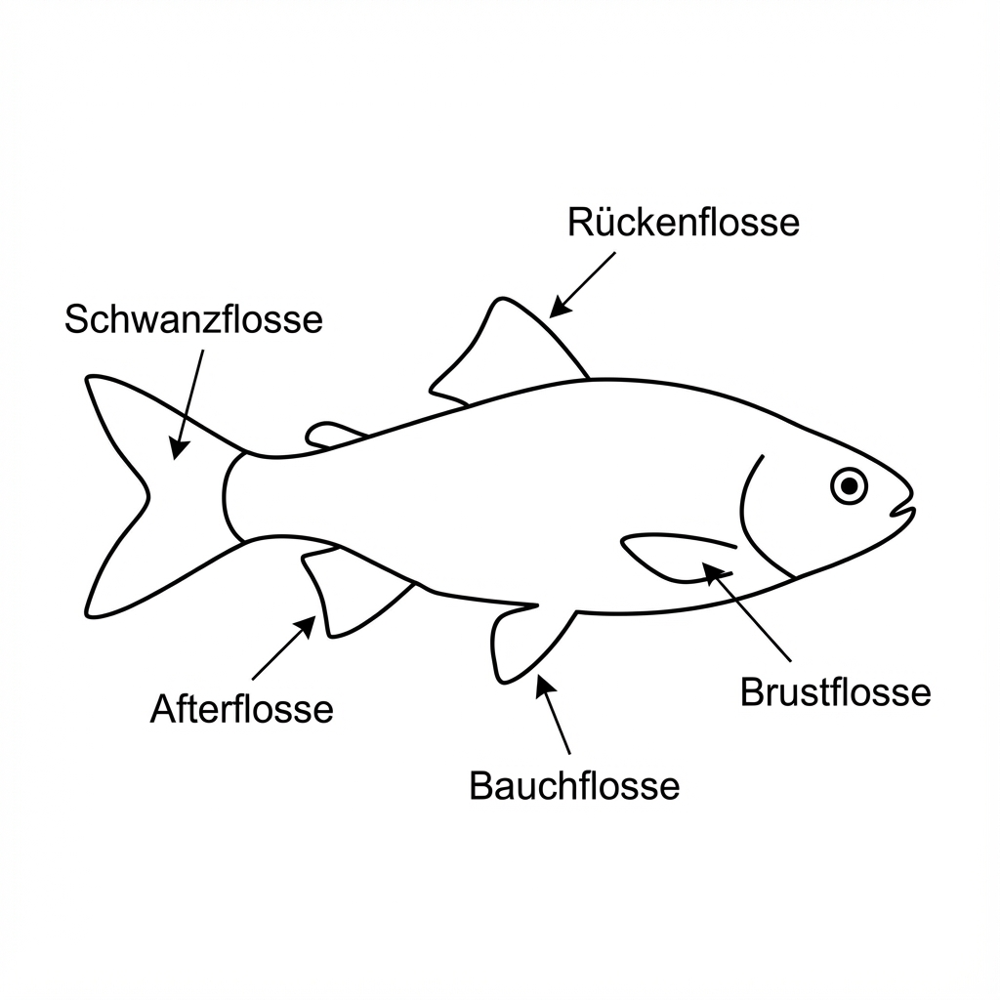
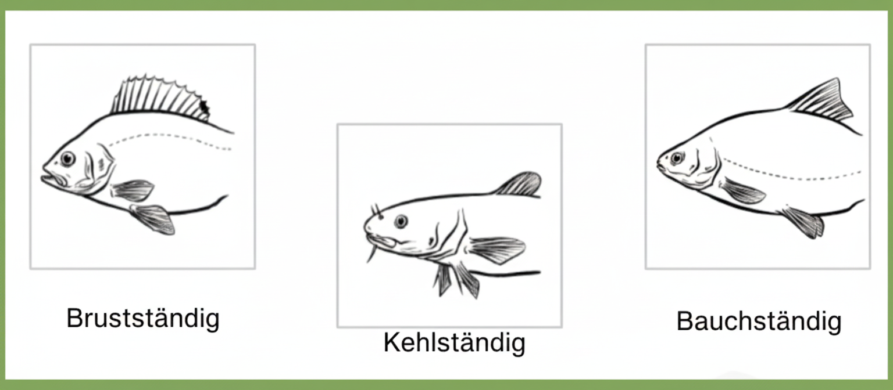
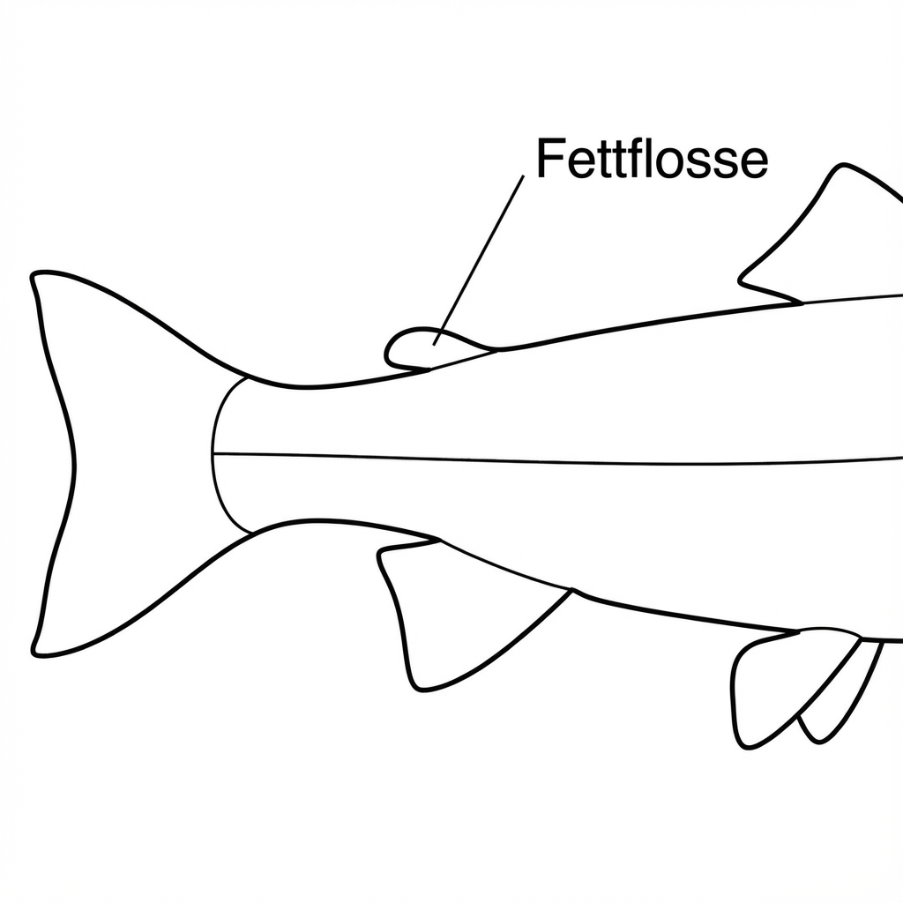

# Allgemeine Fischkunde - Das Fundament des Angelwissens

## Einleitung

Die allgemeine Fischkunde bildet das biologische Fundament für jeden Angler.
In diesem Kapitel behandeln wir ihren Körperbau, ihre Sinne und ihre Fortpflanzung.

## Der Körperbau der Fische

### Die äußere Anatomie

Wenn wir einen Fisch betrachten, sehen wir eine perfekt an das Leben im Wasser angepasste Kreatur.
Der Körper ist stromlinienförmig, wodurch der Fisch mit minimalem Energieaufwand durchs Wasser gleiten kann.

Wir unterscheiden verschiedene typische Körperformen, die viel über den Lebensraum und die Jagdweise verraten:

*   **Spindelförmig (Torpedoförmig):** Der Körper ist im Querschnitt fast rund und verjüngt sich zu beiden Enden. Dies ist die ideale Form für ausdauernde Schwimmer, auch in starker Strömung (z.B. Forelle, Lachs).
    { width=50% }

*   **Pfeilförmig:** Der Körper ist langgestreckt, aber Rücken- und Afterflosse sind weit nach hinten verlagert. Dies ermöglicht keine Ausdauer, aber eine enorme Beschleunigung aus dem Stand für den Beutefang (z.B. Hecht).
    { width=50% }

*   **Hochrückig:** Der Körper ist seitlich stark abgeflacht (z.B. Brasse). Dies sorgt für gute Manövrierfähigkeit in pflanzenreichen Gewässern, ist aber ungünstig in starker Strömung.
    { width=50% }

*   **Schlangenförmig:** Der Körper ist sehr lang und rund (z.B. Aal), ideal um sich am Grund und in engen Spalten zu bewegen.
    { width=50% }

Die Haut des Fisches ist komplex aufgebaut und besteht aus zwei Hauptschichten:

*   **Oberhaut (Epidermis):** Sie enthält viele Schleimzellen, die die wichtige Schleimschicht produzieren.
*   **Lederhaut (Dermis):** Sie ist fester und enthält Blutgefäße, Nerven sowie die Farbzellen. In ihr sind auch die Schuppen verankert.

Die Schuppen liegen wie Dachziegel übereinander und dienen als Schutz.
Man unterscheidet im Wesentlichen zwei Schuppenarten:

*   **Rundschuppen (Cycloidschuppen):** Diese sind am Hinterrand glatt und rund. Streicht man über den Fisch, fühlt er sich glatt an. Typisch für fast alle Friedfische (z.B. Karpfen, Rotauge) und Salmoniden (Forelle).
*   **Kammschuppen (Ctenoidschuppen):** Diese besitzen am Hinterrand kleine Zähnchen oder Dornen. Der Fisch fühlt sich rau an, wie Schmirgelpapier. Kammschuppen sitzen fester als Rundschuppen und sind typisch für Barschhaltige (z.B. Barsch, Zander).

Über der Schuppenschicht liegt die dünne Schleimschicht. Sie reduziert den Wasserwiderstand, schützt vor Krankheitserregern (Bakterien, Pilze) und hilft bei der Osmoregulation. Deshalb ist es so wichtig, beim Umgang mit gefangenen Fischen diese Schleimschicht nicht zu beschädigen (Hände vorher nass machen!).

### Kopf und Maul

Die Form des Maules und die Bezahnung verraten, wo und was ein Fisch frisst.

**Maulstellungen:**

*   **Oberständiges Maul:** Der Unterkiefer ist länger als der Oberkiefer, die Maulspalte zeigt nach oben (z.B. Hecht). Diese Fische jagen oft an der Wasseroberfläche.
    { width=50% }
*   **Endständiges Maul:** Ober- und Unterkiefer sind gleich lang, die Maulspalte zeigt nach vorne (z.B. Forelle, Rotauge). Typisch für Fische, die im freien Wasser jagen.
    { width=50% }
*   **Unterständiges Maul:** Der Oberkiefer ragt über den Unterkiefer, die Maulöffnung zeigt nach unten (z.B. Karpfen, Barbe).
Dies ist typisch für Fische, die ihre Nahrung am Grund suchen (Gründler).
    { width=50% }

**Bezahnung:**

*   **Kieferzähne:** Raubfische (z.B. Hecht, Zander) besitzen oft spitze Zähne im Kiefer (z.B. "Hundszähne"), um Beute zu greifen und festzuhalten.
*   **Schlundzähne:** Friedfische (z.B. Karpfen, Rotauge) haben im Maul selbst keine Zähne ("zahnloses Maul"). Stattdessen sitzen tief im Schlund auf den Schlundknochen Zähne, die die Nahrung gegen eine knöcherne Kauplatte (Karpfenstein) am Schädelboden zermahlen.

### Die Flossen - Steuerung und Antrieb

Fische besitzen verschiedene Arten von Flossen, und jede hat eine spezifische Aufgabe. 
Die **Schwanzflosse** (Caudalflosse) ist der Hauptantrieb. 
Durch seitliche Bewegungen des Schwanzstiels wird der Fisch nach vorne getrieben.
Die Form der Schwanzflosse verrät viel über die Lebensweise: Schnelle Raubfische wie Hechte haben oft gegabelte Schwanzflossen, während Grundfische wie Karpfen eher abgerundete Schwanzflossen besitzen.

{ width=50% }

Die **Rückenflosse** (Dorsalflosse) stabilisiert den Fisch und verhindert ein seitliches Kippen.
Manche Fischarten wie Barsche haben sogar zwei Rückenflossen - eine vordere mit Hartstrahlen als Schutz und eine hintere mit Weichstrahlen.

Die paarigen **Brustflossen** dienen zum Bremsen und für präzise Manöver.
Die **Bauchflossen** unterstützen diese Bewegungen und helfen bei der Stabilisierung.
Die Position der Bauchflossen verrät viel über die Entwicklungsgeschichte:

*   **Kehlständig:** Die Bauchflossen sitzen noch weiter vorne, also vor dem Ansatz der Brustflossen im Kehlbereich (z.B. Quappe oder Dorsch). Diese Anordnung hilft den Fischen oft dabei, sich am Boden abzustützen oder in Bodennähe extrem präzise zu manövrieren.
*   **Brustständig:** Die Bauchflossen sind nach vorne gewandert und sitzen fast direkt *unter* den Brustflossen (z.B. Barsch, Zander). Dies ermöglicht eine noch bessere Manövrierfähigkeit.
*   **Bauchständig:** Die Bauchflossen sitzen weit *hinter* den Brustflossen (z.B. Karpfen, Forelle). Dies ist ein Merkmal eher ursprünglicher Arten.

{ width=50% }

Die **Afterflosse**, unterhalb des Fisches gelegen, sorgt zusammen mit der Rückenflosse für die Richtungsstabilität.

Eine Besonderheit ist die **Fettflosse**. Sie ist eine kleine, strahlenlose Hautfahne zwischen Rücken- und Schwanzflosse. Sie ist ein wichtiges Erkennungsmerkmal für alle lachsartigen Fische (**Salmoniden**) wie Forellen, Äschen und Saiblinge, kommt aber auch bei Zwergwelsen vor. Friedfische wie Karpfen haben *keine* Fettflosse.

{ width=50% }

### Die innere Anatomie

Unter der Oberfläche verbirgt sich ein hochkomplexes System. Das Skelett besteht bei den meisten heimischen Fischen aus Knochen (Knochenfische/Osteichthyes).

{ width=50% }

**Verdauungssystem:**
Der Verdauungstrakt ist eng an die Nahrung angepasst:

*   **Raubfische (Fleischfresser):** Sie haben einen kurzen Darm (oft kürzer als die Körperlänge), da tierische Nahrung leicht verdaulich ist. Der Magen ist oft als dehnbarer Sackmagen ausgebildet, um große Beute aufzunehmen.
*   **Friedfische (Pflanzen-/Allesfresser):** Sie besitzen einen sehr langen Darm (z.B. beim Karpfen 2-3 mal so lang wie der Körper), da pflanzliche Nahrung schwerer aufzuschließen ist. Viele Friedfische haben keinen echten Magen (magenlose Fische).

Ein besonderes Organ ist die **Schwimmblase**. Sie funktioniert wie ein interner Auftriebskörper und ermöglicht es dem Fisch, ohne Energieaufwand in verschiedenen Wassertiefen zu schweben.
Wir unterscheiden dabei zwei Gruppen:

*   **Luftröhrenfische (Physostomen):** Sie haben eine Verbindung zwischen Schwimmblase und Vorderdarm (Ductus pneumaticus). Sie können Druckunterschiede schnell ausgleichen, indem sie Luft "rülpsen" oder schlucken (z.B. Forelle, Hecht, Karpfen).
*   **Luftpumpenfische (Physoklisten):** Diese Verbindung fehlt oder ist verkümmert. Der Gasaustausch erfolgt langsam über das Blut (Gasdrüse). Werden diese Fische (z.B. Barsch, Zander) schnell aus großer Tiefe geholt, dehnt sich die Schwimmblase explosionsartig aus, drückt den Magen aus dem Maul und führt zu tödlichen Verletzungen (Barotrauma). Solche Fische haben kaum Überlebenschancen.

## Die Atmung der Fische

Fische atmen über Kiemen. 
Wasser wird durch das Maul aufgenommen und über die Kiemen wieder ausgeleitet. In den Kiemen befinden sich unzählige feine Blättchen, die Kiemenlamellen, die von hauchfeinen Blutgefäßen durchzogen sind.

Hier findet der Gasaustausch statt: Sauerstoff aus dem Wasser diffundiert ins Blut, während Kohlendioxid ins Wasser abgegeben wird. Dieser Prozess funktioniert nach dem Gegenstromprinzip - das Blut fließt in die entgegengesetzte Richtung wie das Wasser. Dadurch wird eine maximale Sauerstoffausbeute erreicht.

Die Effizienz der Kiemenatmung ist beeindruckend, aber sie hat auch ihre Grenzen.
Bei warmem Wasser sinkt der Sauerstoffgehalt, was für Fische problematisch werden kann, weshalb sie dann oft sauerstoffreichere Bereiche aufsuchen.

* Kaltwasserfische: Arten: Bachforelle, Regenbogenforelle, Äsche, Saibling. Bedarf: Mindestens 7 bis 8 mg/l.
* Fische der Barben- und Brachsenregion: Arten: Barbe, Hecht, Zander, Barsch, Rotauge. Bedarf: Etwa 5 mg/l.
* "Anspruchslose" Friedfische: Arten: Karpfen, Schleie, Karausche, Giebel. Bedarf: Können kurzzeitig bei 2 bis 3 mg/l überleben.

## Das Kreislaufsystem

Das Herz eines Fisches ist einfacher gebaut als das von Säugetieren. Es besteht aus nur zwei Hauptkammern - einem Vorhof und einer Herzkammer. Das Blut wird vom Herzen zu den Kiemen gepumpt, wo es mit Sauerstoff angereichert wird, und fließt dann weiter durch den Körper, bevor es zum Herzen zurückkehrt (einfacher Blutkreislauf).

Da Fische wechselwarm sind - ihre Körpertemperatur also der Umgebungstemperatur entspricht - benötigen sie weniger Energie als gleichwarme Tiere.

## Die Sinnesorgane der Fische

### Das Sehvermögen

Fische können sehen, und zwar oft besser, als viele Angler denken. Die Augen sitzen seitlich am Kopf und ermöglichen ein weites Sichtfeld, allerdings mit einem toten Winkel direkt vor dem Maul. Fische sind kurzsichtig an der Luft, aber unter Wasser können sie scharf sehen und oft Farben wahrnehmen. Für die Köderwahl ist wichtig zu wissen, dass rotes Licht unter Wasser schnell absorbiert wird, während Blau- und Grüntöne auch in größeren Tiefen noch sichtbar sind.

### Das Seitenliniensorgan

Dies ist vielleicht das faszinierendste Sinnesorgan der Fische. Entlang der Körperseiten verläuft eine Linie kleiner Poren - die Seitenlinie. Darunter liegen Sinneszellen, die Druckwellen im Wasser wahrnehmen können.
Mit diesem Organ kann der Fisch Bewegungen registrieren ("Ferntastsinn"), Hindernisse orten und Beute finden, selbst im Dunkeln. Für Angler bedeutet das: Laute Schritte oder Erschütterungen am Ufer werden vom Fisch wahrgenommen und können ihn verscheuchen.

### Der Geruchssinn

Fische haben einen ausgezeichneten Geruchssinn. Sie besitzen Nasenöffnungen (Riechgruben), durch die Wasser strömt. Manche Arten wie Aale können winzigste Duftstoffkonzentrationen wahrnehmen. Dies ist wichtig für Nahrungssuche und Orientierung (z.B. Lachswanderung).

### Der Geschmackssinn

Geschmacksknospen befinden sich nicht nur im Maul, sondern bei vielen Fischarten auch außen am Körper, z.B. auf den Lippen oder auf Barteln (z.B. beim Wels oder der Barbe).

### Das Gehör

Obwohl Fische keine äußeren Ohren haben, können sie hören. Schallwellen werden über den Körper und oft verstärkt durch die Schwimmblase zum Innenohr geleitet. Laute Geräusche am Ufer oder im Boot werden wahrgenommen und können Scheuchwirkung haben.
Eine Besonderheit besitzen die Ostariophysi (dazu gehören Karpfenartige und Welse): Sie verfügen über die **Weber'schen Knöchelchen** (Weber'scher Apparat). Diese Knochenverbindung überträgt Schwingungen von der Schwimmblase direkt zum Innenohr und wirkt wie ein Verstärker. Diese Fische hören daher extrem gut.

## Die Fortpflanzung

In der Fachsprache nennt man das männliche Tier **Milchner** (wegen der milchigen Samenflüssigkeit) und das weibliche Tier **Rogner** (wegen des Rogens/der Eier).

### Laichzeit und Laichverhalten

Die Fortpflanzung (Laichzeit) ist artspezifisch und temperaturabhängig.

*   **Winterlaicher:** z.B. Forelle, Quappe (November bis Februar)
*   **Frühjahrslaicher:** z.B. Hecht, Äsche (Februar bis Mai)
*   **Sommerlaicher:** z.B. Karpfen, Schleie, Wels (Mai bis Juli)

Während der Laichzeit bilden manche Fische ein "Laichkleid" (intensivere Farben) oder einen "Laichhaken" (männliche Forellen).

### Wanderverhalten

Viele Fische unternehmen Wanderungen zum Laichen. Wir unterscheiden:

*   **Anadrome Wanderfische:** Sie leben im Meer und wandern zum Laichen ins Süßwasser (die Flüsse hinauf). Beispiel: Lachs, Meerforelle ("Lachs steigt auf").
*   **Katadrome Wanderfische:** Sie leben im Süßwasser und wandern zum Laichen ins Meer (in die Tiefe). Beispiel: Aal ("Aal steigt ab").
*   **Potamodrome Fische:** Sie wandern innerhalb des Süßwassersystems (z.B. Barbe, Nase).

### Der Laichakt

Die meisten heimischen Fische sind Freilaicher mit äußerer Befruchtung.
Je nach Ablageort unterscheidet man:

*   **Kieslaicher (Lithophile):** Legen Eier in kiesigem Grund ab (z.B. Forelle).
*   **Krautlaicher (Phytophile):** Kleben Eier an Wasserpflanzen (z.B. Hecht, Karpfen).

Einige Arten betreiben Brutpflege (z.B. Stichling, Wels, Zander), die meisten überlassen den Laich sich selbst.

### Die Entwicklung

Aus dem befruchteten Ei schlüpft die Larve, die sich zunächst von ihrem Dottersack ernährt. Danach beginnt sie als Brut selbstständig Plankton zu fressen. Das Wachstum der Jungfische ist stark von der Wassertemperatur und dem Nahrungsangebot abhängig.

## Fischkrankheiten

Als verantwortungsvoller Angler muss man Krankheiten erkennen:

*   **Verhaltensauffälligkeiten:** Taumeln, Apathie, Scheuern am Boden.
*   **Äußere Merkmale:** Geschwüre, Pilzbeläge, Glotzaugen, abstehende Schuppen, blasse Kiemen.

Wichtige Krankheiten:

*   **Fischschimmel (Verpilzung):** Watteartige Beläge, oft nach Verletzung der Schleimhaut.
*   **Weißpünktchenkrankheit (Ichthyophthiriose):** Parasitärer Befall, weiße Punkte auf Haut/Flossen.
*   **Frühjahrsvirämie:** Viruserkrankung oft bei Karpfen (Bauchwassersucht).

## Altersbestimmung

Die gängigste Methode ist die **Schuppen-Methode**: Ähnlich wie bei Baumringen kann man an den Jahresringen auf den Schuppen das Alter eines Fisches ablesen. Im Winter, wenn das Wachstum langsamer ist, entstehen engere Ringe, im Sommer weitere Abstände.

Auch Otolithen (Gehörsteine) oder Kiemendeckelknochen können genutzt werden. Die Kenntnis des Alters ist wichtig für das Fischereimanagement, um z.B. das Wachstum von Populationen zu verstehen und Schonmaße festzulegen.

## Artenbestimmung bei Karpfenartigen (Cypriniden)

Anzahl und und Stellung der Schlundzähne

## Zusammenfassung

Die allgemeine Fischkunde lehrt uns das "Funktionsprinzip Fisch". Von der hydrodynamischen Form über die spezialisierten Sinne bis hin zur Anpassung an verschiedene Gewässerzonen - all dies hilft dem Angler, den Fisch nicht nur als Beute, sondern als komplexes Lebewesen zu verstehen und zu respektieren. Im nächsten Kapitel widmen wir uns der speziellen Fischkunde und den einzelnen Fischarten.

---

