# Spezielle Fischkunde - Die Fischarten unserer Gewässer

## Einleitung

Während die allgemeine Fischkunde uns das grundlegende Verständnis für Fische vermittelt hat, widmen wir uns nun den konkreten Arten, die in deutschen Gewässern leben. Die spezielle Fischkunde ist für jeden Angler von zentraler Bedeutung - nicht nur für die Prüfung, sondern auch für die Praxis. Wer Fische sicher bestimmen kann, weiß, welche Art geschützt ist, welche Schonzeiten gelten und welche Mindestmaße einzuhalten sind.

## Friedfische versus Raubfische

Bevor wir uns den einzelnen Arten widmen, ist es wichtig, die grundlegende Unterscheidung zwischen Friedfischen und Raubfischen zu verstehen.

**Friedfische** ernähren sich hauptsächlich von Pflanzen, Kleintieren, Insektenlarven und Plankton. Sie haben meist ein endständiges oder unterständiges Maul ohne große Zähne. Viele Friedfische leben in Schwärmen und sind eher scheue, vorsichtige Fische.

**Raubfische** jagen andere Fische und größere Beutetiere. Sie besitzen meist ein großes, oberständiges Maul mit kräftigen Zähnen oder Fangzähnen. Raubfische sind oft Einzelgänger und haben eine aggressivere Lebensweise.

Diese Unterscheidung ist nicht immer trennscharf - manche Fischarten wie der Flussbarsch sind sowohl Friedfisch als auch Raubfisch, je nach Größe und Lebensphase.

## Die wichtigsten Friedfische

### Der Karpfen (Cyprinus carpio)

Der Karpfen ist der bekannteste Friedfisch und stammt ursprünglich aus Asien.
Der Karpfen hat keinen Magen und Schlundzähne.

**Erkennungsmerkmale:**
- Hochrückiger, gedrungener Körperbau
- Vier Barteln am Obermaul (zwei lange, zwei kurze)
- Große, goldfarbene bis bronzene Schuppen
- Lange Rückenflosse mit einem gezähnten Hartstrahl
- Kann über 1 Meter lang und über 30 kg schwer werden

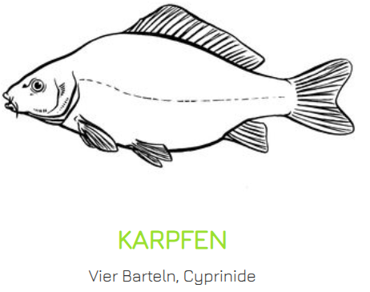{ width=50% }

**Lebensweise:**
Karpfen bevorzugen stehende oder langsam fließende, warme Gewässer mit Pflanzenbewuchs und schlammigem Grund.
Sie sind Allesfresser und ernähren sich von Bodentieren, Schnecken, Muscheln, Würmern und Pflanzen.
Im Winter verfallen sie in eine Art Winterruhe und fressen kaum.

**Laichzeit:** Mai bis Juli bei Wassertemperaturen über 18°C

**Besonderheiten:**
Es gibt verschiedene Zuchtformen wie Spiegelkarpfen (wenige, große Schuppen), Lederkarpfen (fast ohne Schuppen) und Schuppenkarpfen (die ursprüngliche Wildform). Karpfen können sehr alt werden - über 50 Jahre sind möglich.
Graskarpfen hat keine Barteln und ist eine invasive Art.

### Die Schleie (Tinca tinca)

Die Schleie ist ein scheuer, bodenbewohnender Friedfisch, der oft übersehen wird, aber ein faszinierendes Leben führt.

**Erkennungsmerkmale:**
- Gedrungener, hochrückiger Körper
- Sehr kleine Schuppen, die in dicker Schleimschicht eingebettet sind
- Grünlich-bronzene bis goldbraune Färbung
- Zwei kurze Barteln an den Mundwinkeln
- Abgerundete Flossen
- Kleine, rote Augen

**Lebensweise:**
Schleien lieben verkrautete Gewässer mit weichem, schlammigem Grund. Sie sind dämmerungs- und nachtaktiv und verbringen den Tag oft versteckt im Pflanzendickicht. Sie ernähren sich von Würmern, Schnecken, Insektenlarven und Pflanzen.

**Laichzeit:** Mai bis Juli

**Besonderheiten:**
Schleien können in sauerstoffarmen Gewässern überleben, in denen andere Fische eingehen würden. Ihr dicker Schleimmantel schützt sie vor Krankheiten und Verletzungen.

{ width=50% }

### Der Brassen (Abramis brama)

Der Brassen, auch Brachse oder Blei genannt, ist in vielen Gewässern der häufigste Weißfisch.
Kann sein Maul wie einen Rüssel vorstülpen.

**Erkennungsmerkmale:**
- Stark hochrückiger, seitlich sehr abgeflachter Körper ("scheibenförmig")
- Kleiner, rüsselartiger, unterständiger Mund
- Silbrig-graue bis bronzefarbene Färbung
- Lange Afterflosse (über 23 Strahlen)
- Kann bis 75 cm lang und 6 kg schwer werden

**Lebensweise:**
Brassen leben in großen Schwärmen in stehenden und langsam fließenden Gewässern. Sie ernähren sich am Grund von Würmern, Schnecken, Muscheln und Pflanzenteilen. Typisch ist das "Gründeln" - dabei stehen sie kopfüber im Schlamm und suchen nach Nahrung.

**Laichzeit:** Mai bis Juni

**Besonderheiten:**
Junge Brassen haben regional unterschiedliche Bezeichnungen; oft wird 'Brachse' aber auch synonym für die Art an sich verwendet.
In nährstoffreichen Gewässern können Brassen zur dominanten Art werden.

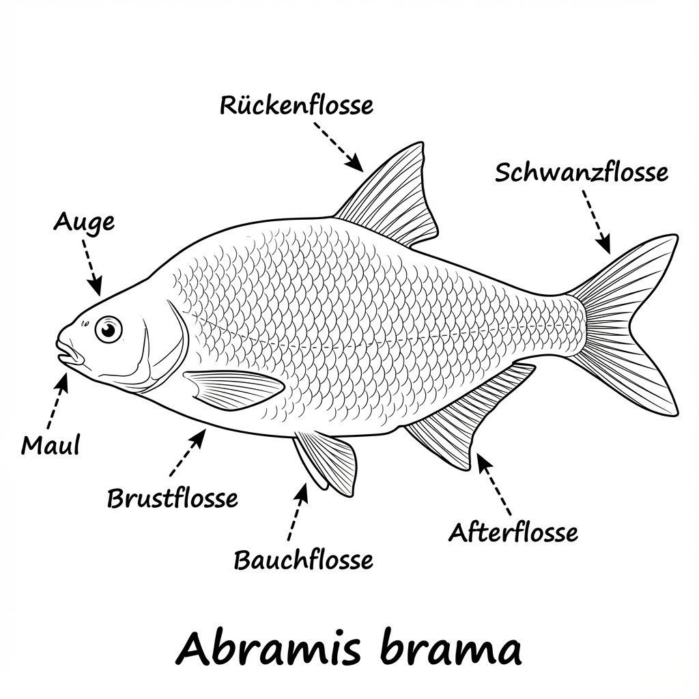{ width=50% }

### Die Rotfeder (Scardinius erythrophthalmus)

Die Rotfeder wird oft mit dem Rotauge verwechselt, ist aber bei genauem Hinsehen leicht zu unterscheiden.

**Erkennungsmerkmale:**
- Hochrückiger Körper, seitlich abgeflacht
- Oberständiges Maul
- Goldglänzende Schuppen
- Leuchtend rote Flossen
- Rote bis orangefarbene Augen
- Die Rückenflosse beginnt HINTER dem Ansatz der Bauchflossen

**Lebensweise:**
Rotfedern bevorzugen pflanzenreiche, stehende oder langsam fließende Gewässer. Im Gegensatz zum Rotauge halten sie sich mehr in mittleren Wasserschichten auf. Sie ernähren sich von Insekten, deren Larven und Pflanzenmaterial.

**Laichzeit:** April bis Juni

**Besonderheiten:**
Der wichtigste Unterschied zum Rotauge: Bei der Rotfeder ist das Maul oberständig und die Rückenflosse sitzt weiter hinten.

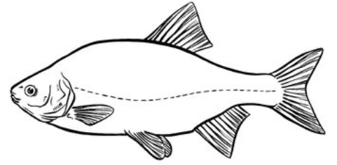{ width=50% }

### Das Rotauge (Rutilus rutilus)

Das Rotauge, auch Plötze genannt, ist einer der häufigsten Fische in deutschen Gewässern.

**Erkennungsmerkmale:**
- Schlanker, seitlich abgeflachter Körper
- Endständiges Maul
- Silbrige Schuppen
- Rötliche Flossen (weniger intensiv als bei der Rotfeder)
- Rote Augen
- Die Rückenflosse beginnt ÜBER dem Ansatz der Bauchflossen

**Lebensweise:**
Rotaugen sind extrem anpassungsfähig und kommen in fast allen Gewässertypen vor. Sie leben in großen Schwärmen und ernähren sich von Insekten, Würmern, Schnecken und Pflanzen.

**Laichzeit:** April bis Juni

**Besonderheiten:**
Das Rotauge ist ein idealer Einsteigerfisch und gilt als guter Köderfisch für das Raubfischangeln.
Endständiges Maul.

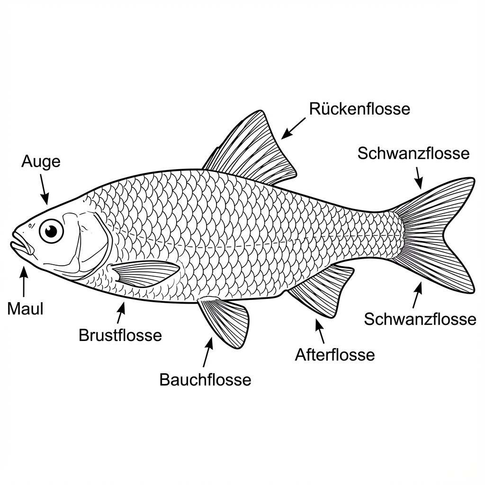{ width=50% }

### Die Barbe (Barbus barbus)

Die Barbe ist ein typischer Bewohner schnell fließender, sauerstoffreicher Flüsse.
Hält sich am Grund auf.
Die Barbe ist ein Knochenfisch mit unterständigem Maul.

**Erkennungsmerkmale:**
- Langgestreckter, torpedoförmiger Körper
- Unterständiges Rüsselmaul mit vier langen Barteln
- Große Schuppen
- Grünlich-braune Rückenfärbung, goldgelbe Flanken
- Kräftige Schwanzflosse

**Lebensweise:**
Barben sind typische Flussfische, die starke Strömungen lieben. 
Sie halten sich am Grund auf und ernähren sich von Würmern, Schnecken, Insektenlarven und kleinen Fischen. Sie sind ausgezeichnete Schwimmer.

**Laichzeit:** Mai bis Juli

**Besonderheiten:**
Der Laich und die Rogen der Barbe sind giftig und dürfen nicht verzehrt werden!
Die Barbe gibt einer Gewässerregion ihren Namen - die Barbenregion.

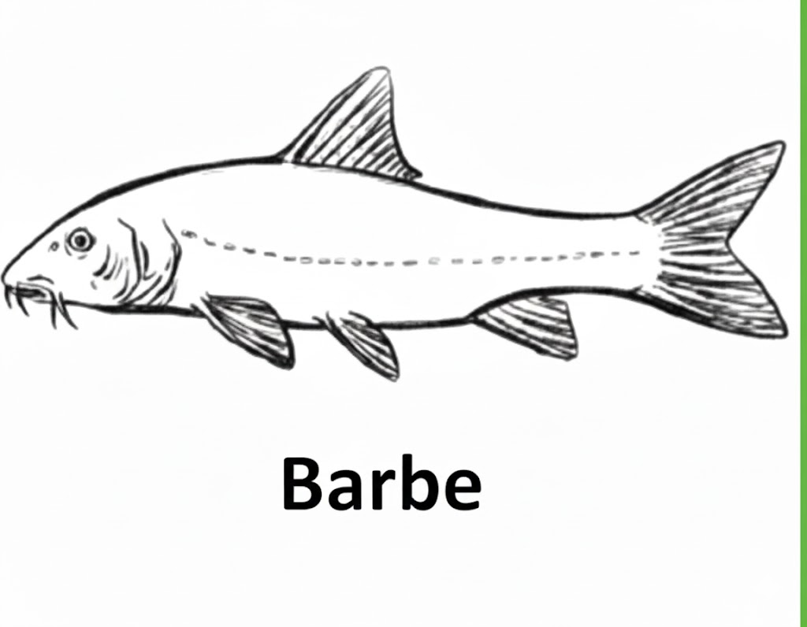{ width=50% }

### Der Döbel (Squalius cephalus)

Der Döbel, auch Aitel genannt, ist ein kräftiger, kampfstarker Fisch.

**Erkennungsmerkmale:**
- Walzenförmiger, gedrungener Körper
- Großes, endständiges Maul
- Große Schuppen mit dunklem Rand
- Bauch- und Afterflossen oft rötlich
- Goldbraune bis graugrüne Färbung

**Lebensweise:**
Döbel sind vielseitige Fische, die sowohl in Flüssen als auch in Seen vorkommen. Sie sind Allesfresser und nehmen fast alles - von Insekten über Würmer bis hin zu kleinen Fischen und sogar Früchten. Größere Döbel jagen aktiv kleine Fische.

**Laichzeit:** April bis Juni

**Besonderheiten:**
Der Döbel ist ein intelligenter, vorsichtiger Fisch, der schwer zu überlisten ist. Er beißt auf viele verschiedene Köder.

{ width=50% }

### Stichling

Die Stachelstrahlen der Rückflosse ist nicht mit Flossenhaut verbunden.
Nutzt selbstgebaute Nester.
Männchen machen die Brutpflege.

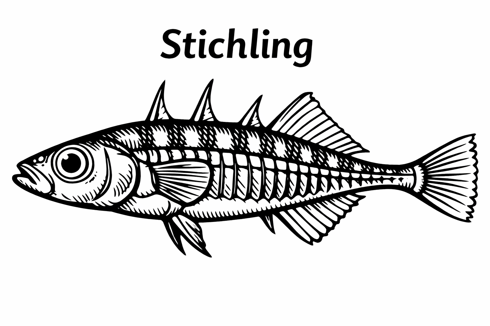{ width=50% }

### Hering

Keine sichtbare Seitenlinie.

### Karausche

Keine Barteln, benötigt nur 3mg/L Sauerstoff 

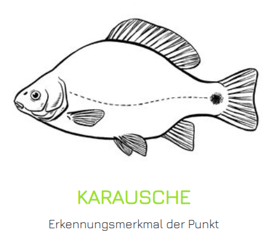{ width=50% }

### Moderlieschen

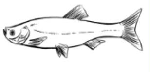{ width=50% }

### Bitterling

Legt seine Eier in Muscheln ab

### Schlammpeitziger

Hat 10 Barteln

### Makrele

Keine Schwimmblase

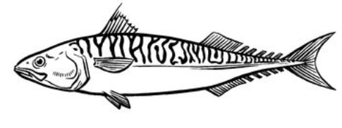{ width=50% }

### Quappe

Einziger Süßwasserdorsch.

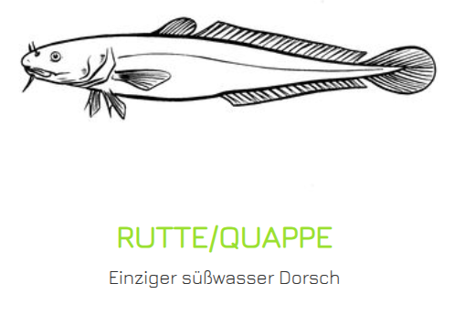{ width=50% }

### Schellfisch

10 - 200 m über den Meeresboden.
Haben eine Bartel.
Schwarzer Fleck über der Bauchflosse ist Erkennungsmerkmal.

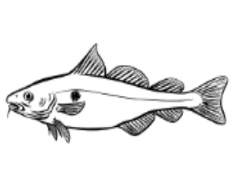{ width=50% }

## Die wichtigsten Raubfische

### Der Hecht

Der Hecht ist der Raubfisch schlechthin - ein perfekter Jäger mit beeindruckendem Gebiss.

**Erkennungsmerkmale:**
- Langgestreckter, torpedoförmiger Körper
- Entenschnabelartiges, mit scharfen Zähnen besetztes Maul
- Rücken- und Afterflosse weit nach hinten verlagert
- Grünliche bis bräunliche Färbung mit helleren Flecken und Bändern
- Kann über 1,30 m lang und über 20 kg schwer werden

**Lebensweise:**
Hechte sind Lauerjäger, die aus dem Hinterhalt ihre Beute angreifen. Sie bevorzugen pflanzenreiche Gewässer mit Versteckmöglichkeiten. Sie ernähren sich hauptsächlich von Fischen, fressen aber auch Frösche, Mäuse und Wasservögel.

**Laichzeit:** Februar bis Mai (Frühjahrslaicher)

**Besonderheiten:**
Der Hecht hat über 700 nach hinten gerichtete Zähne. Weibchen werden deutlich größer als Männchen. Alte, große Weibchen nennt man "Hechtmütter".

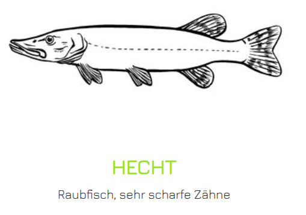{ width=50% }

### Rapfen

Oberständiges Maul, d.h. jagt im oberen Wasserbereich.

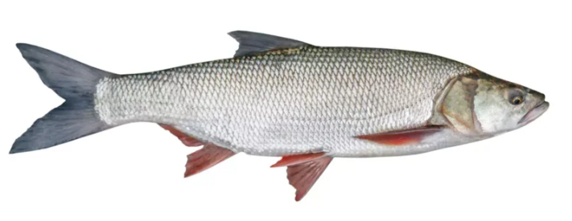{ width=50% }

### Der Zander

Der Zander ist ein hervorragender Speisefisch und geschätzter Angelzielfisch.

**Erkennungsmerkmale:**
- Langgestreckter, spindelförmiger Körper
- Zwei getrennte Rückenflossen (die erste mit Hartstrahlen)
- Großes Maul mit Fangzähnen und vielen kleinen Zähnen
- Graugrüne Färbung mit dunklen Querstreifen
- Große, glasige Augen (Dämmerungsjäger)

**Lebensweise:**
Zander bevorzugen große, tiefe, klare Gewässer mit festem Grund. Sie sind dämmerungs- und nachtaktiv. Ihre großen, lichtempfindlichen Augen ermöglichen es ihnen, auch bei schlechten Lichtverhältnissen zu jagen.

**Laichzeit:** April bis Juni

**Besonderheiten:**
Zander betreiben Brutpflege - das Männchen bewacht und belüftet das Gelege. Zander sind empfindlich gegenüber Wasserverschmutzung.

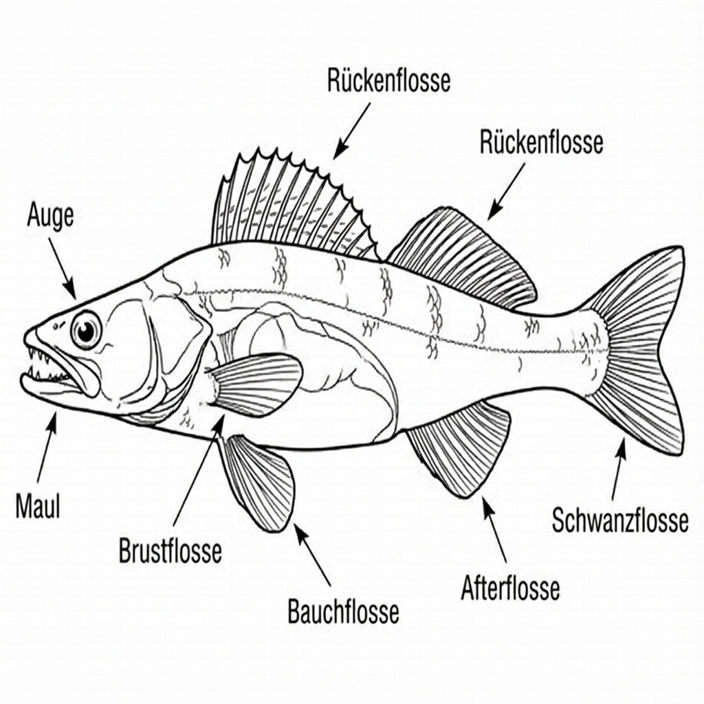{ width=50% }

### Der Flussbarsch

Der Barsch ist einer der häufigsten Raubfische und an seiner charakteristischen Färbung leicht zu erkennen.

**Erkennungsmerkmale:**
- Hochrückiger, seitlich abgeflachter Körper
- Zwei Rückenflossen (die erste mit Hartstrahlen, oft mit schwarzem Fleck)
- Markante dunkle Querstreifen (meist 5-9 Stück)
- Rötliche Bauch-, After- und Schwanzflossen
- Großes Maul mit Bürstenzähnen
- Kammschuppen

**Lebensweise:**
Barsche leben in Schwärmen, wobei sich oft gleichgroße Fische zusammenschließen. 
Sie bevorzugen struktur- und pflanzenreiche Gewässer.
Kleine Barsche ernähren sich von Insektenlarven und Würmern, größere jagen Fische.

**Laichzeit:** April bis Juni

**Besonderheiten:**
Die stacheligen Hartstrahlen der Rückenflosse können schmerzhafte Verletzungen verursachen.
Barsche sind sehr neugierig und oft leicht zu fangen.

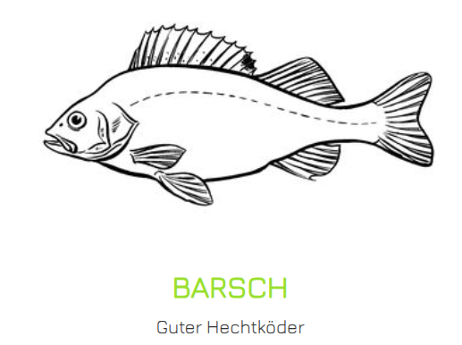{ width=50% }

### Die Forelle (Salmo trutta)

Die Forelle tritt in verschiedenen Formen auf - als Bachforelle, Seeforelle und Meerforelle (alle gehören zur gleichen Art).

**Erkennungsmerkmale:**
- Spindel- bzw. torpedoförmiger Körper
- Kleine Fettflosse zwischen Rücken- und Schwanzflosse
- Zahlreiche schwarze und rote Punkte auf den Flanken
- Großes Maul mit vielen kleinen Zähnen
- Färbung variiert je nach Lebensraum

**Lebensweise:**
Bachforellen bevorzugen kalte, sauerstoffreiche, schnell fließende Bäche und Flüsse.
Sie sind standorttreu und verteidigen ihr Revier.
Sie ernähren sich von Insekten, deren Larven, Krebstieren und kleineren Fischen.

**Laichzeit:** Oktober bis Januar (Winterlaicher!)

**Besonderheiten:**
Forellen benötigen sehr sauberes, sauerstoffreiches Wasser. Sie sind ausgezeichnete Indikatoren für gute Wasserqualität. Die Fettflosse ist charakteristisch für alle Salmoniden (Lachsartige).
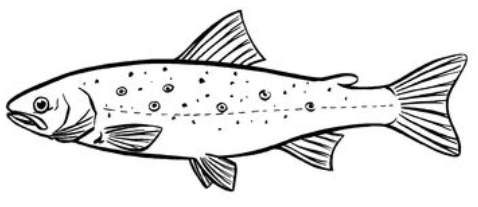{ width=50% }

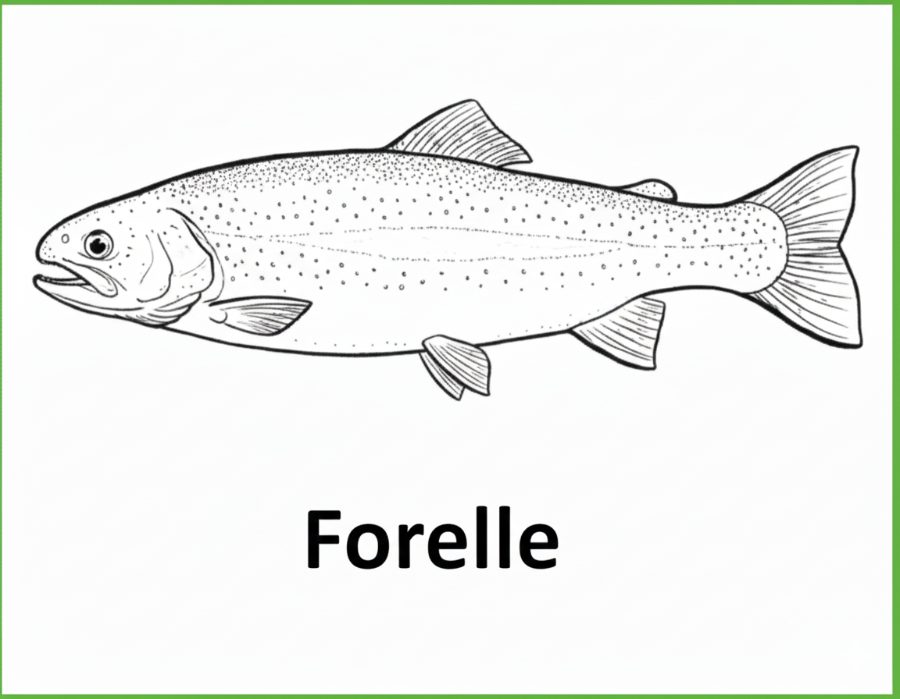{ width=50% }

### Die Regenbogenforelle  

Die Regenbogenforelle stammt ursprünglich aus Nordamerika und wurde in Europa eingebürgert.

**Erkennungsmerkmale:**
- Ähnlich der Bachforelle, aber mit charakteristischem rosa-violettem Längsband
- Fettflosse vorhanden
- Zahlreiche schwarze Punkte, auch auf der Schwanzflosse
- Meist keine roten Punkte

**Lebensweise:**
Ähnlich wie Bachforellen, aber weniger anspruchsvoll bezüglich Wasserqualität und Temperatur. Werden oft in Forellenteichen besetzt.

**Laichzeit:** März bis Mai

**Besonderheiten:**
Regenbogenforellen wachsen schneller als Bachforellen und werden größer. Sie vermehren sich in den meisten europäischen Gewässern nicht natürlich.

### Der Wels (Silurus glanis)

Der Wels ist der größte reine Süßwasserfisch Europas - ein wahrer Riese.

**Erkennungsmerkmale:**
- Langgestreckter, walzenförmiger Körper ohne Schuppen
- Sehr breites, flaches Maul mit zahllosen kleinen Zähnen
- Sechs lange Barteln (zwei sehr lange am Oberkiefer, vier kurze am Unterkiefer)
- Kleine Augen
- Grünlich-braune bis schwarze Färbung, oft marmoriert
- Kann über 2,50 m lang und über 100 kg schwer werden

**Lebensweise:**
Welse sind überwiegend dämmerungs- und nachtaktiv. Sie bevorzugen warme, stehende oder langsam fließende Gewässer mit vielen Verstecken. Sie sind Lauerjäger und fressen alles, was sie bewältigen können - Fische, Krebse, Muscheln, manchmal auch Wasservögel.

**Laichzeit:** Mai bis Juli

**Besonderheiten:**
Welse betreiben Brutpflege. Sie können sehr alt werden (über 50 Jahre). Ihre Barteln sind hochsensible Tastorgane zum Aufspüren von Beute im Dunkeln.

## Weitere wichtige Fischarten

### Der Aal (Anguilla anguilla)

Keine Zwischenmuskelgräten.

**Erkennungsmerkmale:**
- Schlangenförmiger, langgestreckter Körper
- Sehr kleine Schuppen, in Haut eingebettet
- Rücken-, Schwanz- und Afterflosse zu einem Flossensaum verschmolzen
- Dunkelgrüner bis brauner Rücken, gelber Bauch

**Lebensweise:**
Aale sind nachtaktive Raubfische, die sich tagsüber im Schlamm vergraben.
Sie ernähren sich von Würmern, Schnecken, Insektenlarven und Fischen.

**Laichzeit:**
Aale haben einen einzigartigen Lebenszyklus: Sie werden in der Sargassosee (Atlantik) geboren, wandern als **Glasaale** zu europäischen Küsten und steigen in Flüsse auf. 

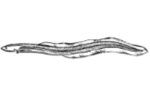{ width=50% }

Nach 10-20 Jahren wandern sie zurück ins Meer zum Laichen (Blankaal).
Bekommt große Augen und After verschließt sich.

**Besonderheiten:**
Aale sind vom Aussterben bedroht.
Es gelten strenge Fangbeschränkungen.
Sie können über Land kriechen und sind extrem zählebig.

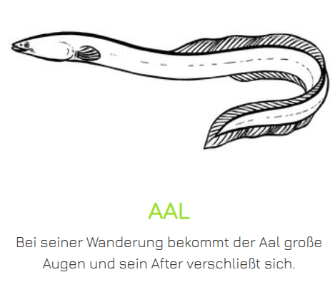{ width=50% }

### Neunauge

Neunaugen sind biologisch gesehen eigentlich keine echten Fische, sondern gehören zur Gruppe der Rundmäuler (Kieferlose). Sie haben kein Skelett aus Knochen, sondern aus Knorpel, und besitzen keinen Kiefer, sondern ein rundes Saugmaul.

### Dornhai

Zwei Dornen, die allergische Reaktionen verursachen können.

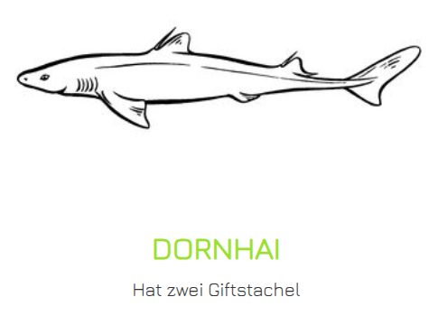{ width=50% }

### Die Äsche (Thymallus thymallus)

**Erkennungsmerkmale:**
- Gestreckter, seitlich abgeflachter Körper
- Sehr große, segelartige Rückenflosse (beim Männchen besonders ausgeprägt)
- Fettflosse vorhanden
- Großschuppig mit violetten Längsstreifen
- Großes Maul mit kleinen Zähnen

**Lebensweise:**
Äschen bevorzugen schnell fließende, sauerstoffreiche Flüsse mit kiesigem Grund. Sie ernähren sich hauptsächlich von Insekten und deren Larven.

**Laichzeit:** März bis Mai

**Besonderheiten:**
Die Äsche gibt einer Gewässerregion ihren Namen - die Äschenregion.
Sie ist ein Indikator für sehr gute Wasserqualität und steht unter besonderem Schutz.

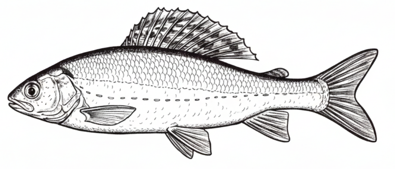{ width=50% }

### Der Kaulbarsch

**Erkennungsmerkmale:**
- Kleiner, gedrungener Fisch (meist 10-15 cm)
- Zwei zusammengewachsene Rückenflossen
- Großer Kopf mit großen Augen
- Raue Haut (auch auf Kiemendeckeln)
- Graubraune bis grünliche Färbung mit dunklen Flecken

**Lebensweise:**
Kaulbarsche leben gesellig in stehenden und langsam fließenden Gewässern. Sie halten sich am Grund auf und ernähren sich von Würmern, Insektenlarven und Fischlaich.

**Laichzeit:** April bis Mai

**Besonderheiten:**
Gilt als Lästling, da er sich manchmal massenhaft vermehrt und als Laichräuber anderen Fischarten schaden kann.

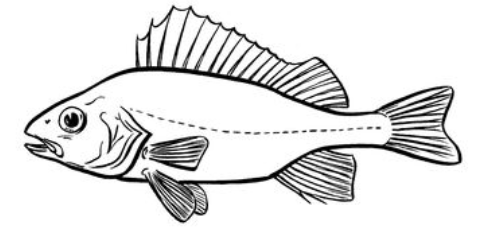{ width=50% }

## Geschützte und besondere Arten

### Der Stör

Störe waren früher in deutschen Flüssen heimisch, sind aber ausgestorben. Es gibt Wiederansiedlungsprojekte. Störe stehen unter strengstem Schutz.

### Die Nase (Chondrostoma nasus)

Ein Fisch mit charakteristisch unterständigem Maul zum Abweiden von Algen. Geschützt und gefährdet.

### Der Lachs (Salmo salar)

Ebenfalls ein wandernder Fisch, der in vielen Flüssen ausgestorben ist. Es gibt Wiederansiedlungsprogramme. Streng geschützt.

## Unterscheidungsmerkmale und Verwechslungsgefahren

### Rotauge vs. Rotfeder
- **Rotauge**: Endständiges Maul, Rückenflosse über Bauchflossenansatz
- **Rotfeder**: Oberständiges Maul, Rückenflosse hinter Bauchflossenansatz

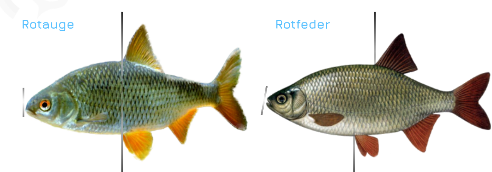{ width=50% }

### Bachforelle vs. Regenbogenforelle
- **Bachforelle**: Rote und schwarze Punkte, kein rosa Band
- **Regenbogenforelle**: Rosa Längsband, schwarze Punkte auf Schwanzflosse

### Döbel vs. Hasel
- **Döbel**: Größer, große Schuppen, rötliche Bauchflossen
- **Hasel**: Kleiner, kleinere Schuppen, schlanker

### Barbe vs. Gründling
- **Barbe**: Groß (bis 80 cm), 4 Barteln
- **Gründling**: Klein (bis 15 cm), 2 Barteln

## Schonzeiten und Mindestmaße

Es ist von zentraler Bedeutung, dass jeder Angler die Schonzeiten und Mindestmaße kennt. Diese dienen dem Schutz der Fischbestände und stellen sicher, dass sich Fische mindestens einmal fortpflanzen können, bevor sie entnommen werden dürfen.

**Wichtig:** Schonzeiten und Mindestmaße variieren von Bundesland zu Bundesland! Informiere dich immer über die lokalen Bestimmungen.

**Allgemeine Prinzipien:**
- Schonzeiten liegen meist in der Laichzeit
- Mindestmaße orientieren sich an der Geschlechtsreife
- Ganzjährig geschonte Arten dürfen niemals entnommen werden
- Auch außerhalb der Schonzeit gilt: Laichfische schonen!

## Zusammenfassung und Prüfungstipps

Für die Fischerprüfung ist es essentiell, die wichtigsten Fischarten sicher zu erkennen. Folgende Fische solltest du in jedem Fall kennen:

**Friedfische:** Karpfen, Schleie, Brassen, Rotauge, Rotfeder, Barbe, Döbel

**Raubfische:** Hecht, Zander, Barsch, Forelle, Regenbogenforelle, Wels, Aal

**Lernempfehlungen:**
1. Präge dir charakteristische Merkmale ein (z.B. Barteln beim Karpfen, rosa Band bei Regenbogenforelle)
2. Lerne die Flossen-Formeln (Anzahl der Flossen, Hartstrahlen vs. Weichstrahlen)
3. Nutze Bildmaterial - viele Prüfungen enthalten Bilderfragen
4. Achte auf Details wie Maul-Stellung, Färbung, Schuppentyp
5. Übe Verwechslungsarten besonders gründlich

Die spezielle Fischkunde ist nicht nur Prüfungsstoff - sie ist der Schlüssel zu erfolgreichem und verantwortungsvollem Angeln. Wer seine Fische kennt, der angelt gezielter, schützt gefährdete Arten und respektiert die Natur.

Im nächsten Kapitel widmen wir uns der Gewässerkunde - dem Lebensraum der Fische.

---

*Hinweis: Dieses Dokument dient der Prüfungsvorbereitung für den Angelschein. Spezifische Schonzeiten und Mindestmaße variieren je nach Bundesland und müssen lokal recherchiert werden.*
