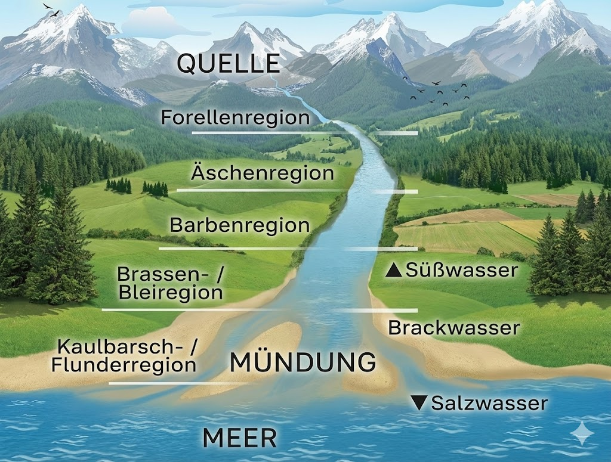

# Gewässerkunde - Der Lebensraum der Fische

## Einleitung

Ein Gewässer ist ein Ökosystem, in dem unzählige Organismen in fein abgestimmten Beziehungen zueinander leben.

## Gewässertypen

### Fließgewässer

Fließgewässer sind durch fließendes Wasser charakterisiert, von kleinen Bächen bis zu großen Strömen.

**Merkmale von Fließgewässern:**
- Ständige Bewegung des Wassers
- Wechselnde Strömungsgeschwindigkeiten
- Unterschiedliche Substrate (Kies, Sand, Steine)
- Höhere Sauerstoffgehalte durch Wasserbewegung
- Temperatur meist niedriger und gleichmäßiger als in Stillgewässern

**Einteilung nach Strömung:**
- **Oberlauf**: Schnelle Strömung, steiles Gefälle, steiniger Grund, kaltes, sauerstoffreiches Wasser
- **Mittellauf**: Mittlere Strömung, wechselnder Grund, moderate Temperaturen
- **Unterlauf**: Langsame Strömung, sandiger oder schlammiger Grund, wärmeres Wasser

### Stillgewässer

Stillgewässer haben keine oder nur sehr geringe Strömung.
Dazu gehören Seen, Weiher, Teiche und Talsperren.

**Merkmale von Stillgewässern:**
- Stehendes oder sehr langsam bewegtes Wasser
- Schichtung des Wassers nach Temperatur
- Unterschiedliche Sauerstoffverteilung in verschiedenen Tiefen
- Oft stärkerer Pflanzenwuchs
- Größere Temperaturschwankungen als in Fließgewässern

**Einteilung nach Entstehung:**

### Natürliche Seen
Durch geologische Prozesse entstanden (z.B. Gletscherseen).

### Talsperren
Künstlich durch Aufstauen von Flüssen entstanden.
Ihnen fehlen oft ausgedehnte Flachzonen mit Wasserpflanzen.

### Weiher und Teiche
Kleinere, oft künstlich angelegte Gewässer.

### Baggerseen
Baggerseen sind durch Kies- oder Sandabbau entstanden. Ziegelteiche sind alte Lehmgruben. Sie haben keinen Zulauf und sind vom Grundwasser abhängig.

### Altwasser
Ehemals Teil von einem Flus, abgetrennt, dadurch Stillgewässer.
Altarm ist eine Vorstufe und hat noch eine geringe Verbindugn zum Hauptstrom.

### Baggerseen

Baggerseen sind durch Kies- oder Sandabbau entstanden.
Ziegelteiche sind alte Lehmgruppen.
Keine Zulauf und sich vom Grundwasser abhängig.

## Die Gewässerregionen (Fischregionen)

Fließgewässer werden nach den dort vorkommenden Leitfischarten in verschiedene Regionen eingeteilt.
Diese Einteilung beschreibt die typischen ökologischen Bedingungen.

### Forellenregion

**Charakteristik:**
- Oberlauf von Bächen und Flüssen
- Schnelle Strömung, kaltes Wasser (unter 15°C)
- Hoher Sauerstoffgehalt
- Steiniger, kiesiger Grund
- Wenig Pflanzenwuchs

**Leitfische:**
Bachforelle, Groppe, Bachsaibling

### Äschenregion

**Charakteristik:**
- Mittlerer Oberlauf
- Mäßige bis starke Strömung
- Kühles Wasser (ca. 15-18°C)
- Kiesiger Grund mit Sand
- Etwas mehr Pflanzenwuchs

**Leitfisch:**
Äsche

**Weitere Arten:**
Bachforelle, Döbel, Hasel, Barbe

### Barbenregion

**Charakteristik:**
- Mittellauf größerer Flüsse
- Mäßige Strömung mit ruhigeren Bereichen
- Wärmeres Wasser (ca. 18-22°C)
- Kiesig-sandiger Grund
- Zunehmender Pflanzenwuchs

**Leitfisch:**
Barbe

**Weitere Arten:**
Döbel, Hasel, Nase, Hecht, Barsch, Aal

### Brachsenregion

**Charakteristik:**
- Unterlauf großer Flüsse
- Langsame Strömung
- Warmes Wasser (über 20°C möglich)
- Sandiger bis schlammiger Grund
- Starker Pflanzenwuchs

**Leitfisch:**
Brassen (Brachse/Blei)

**Weitere Arten:**
Rotauge, Rotfeder, Zander, Hecht, Aal, Karpfen, Schleie

### Kaulbarsch-Flunder-Region

**Charakteristik:**
- Mündungsbereich in die Nord- oder Ostsee
- Brackwasser (Salzgehalt schwankend)
- Gezeiteneinfluss möglich

**Leitfische:**
Kaulbarsch, Flunder

**Weitere Arten:**
Aal, Zander, Hecht

## Gewässerschichtung in Stillgewässern

In Seen und größeren Stillgewässern kommt es zu einer charakteristischen Schichtung des Wassers, die für das Leben der Fische von großer Bedeutung ist.

### Die Temperaturschichtung im Sommer

**Oberschicht:**
- Warmes Wasser (15-25°C)
- Gute Durchmischung durch Wind
- Hoher Sauerstoffgehalt
- Viel Licht, starkes Pflanzenwachstum

**Sprungschicht:**

Wenn sich das Oberflächenwasser stark erhitzt und sich das kalte Wasser nicht mehr mit dem warme Wasser vermischen kann, entsteht eine Sprungschicht.

**Tiefenschicht:**
- Kaltes Wasser (4-8°C)
- Keine Durchmischung
- Kein Licht
- Sauerstoffgehalt kann im Sommer abnehmen

### Frühjahrs- und Herbstzirkulation

Zweimal im Jahr, im Frühjahr und Herbst, kommt es zur vollständigen Durchmischung des Sees:
Diese Durchmischungen sind essentiell für die Sauerstoffversorgung der Tiefenzonen.

**Frühjahrszirkulation:**
Das Oberflächenwasser erwärmt sich auf 4°C, wird dadurch schwerer als die kälteren Wasserschichten und sinkt ab.
Dadurch wird der gesamte See durchmischt.
Sauerstoff gelangt in die Tiefe, Nährstoffe nach oben.

**Herbstzirkulation:**
Ähnlicher Prozess nach dem Sommer.

**Bedeutung für Fische:**
Im Sommer ziehen sich Kaltwasserfische wie Forellen und Saiblinge in kühlere Tiefen zurück.
Im Winter, wenn die Oberfläche gefriert, sammeln sich viele Fische in tieferen, wärmeren Zonen (bei 4°C hat Wasser seine größte Dichte).

## Wasserqualität und Wassergüte

### Physikalische Parameter

**Temperatur:**
Einer der wichtigsten Faktoren.
Sie beeinflusst:
- Sauerstoffgehalt (kaltes Wasser kann mehr Sauerstoff aufnehmen)
- Stoffwechsel der Fische (höhere Temperatur = höhere Aktivität)
- Verbreitung von Fischarten

**Trübung:**
- Beeinflusst Lichtdurchdringung
- Wichtig für Pflanzenwachstum
- Kann durch Schwebstoffe oder Algenblüten verursacht sein

**pH-Wert:**
- Maß für Säure oder Base, weniger als 7 ist das Wasser sauer, mehr als 7 ist es alkalisch.
- Optimaler Bereich für die meisten Fische: pH 6,5-8,5
- Zu saures oder zu alkalisches Wasser schädigt Fische

### Chemische Parameter

**Sauerstoff (O₂):**
- Notwendig für die Atmung
- Karauschen, Karpfen und Schleien kommen mit 2-3 mg/l aus
- Mindestgehalt für die meisten Fische: 4-6 mg/l
- Forellen benötigen mindestens 6-8 mg/l
- Sauerstoffmangel (besonders im Sommer und nachts) kann zu Fischsterben führen

**Kohlendioxid (CO₂):**
- Entsteht bei Atmung und organischem Abbau
- Zu viel CO₂ ist giftig für Fische
- Wird durch Photosynthese der Pflanzen verbraucht

**Stickstoffverbindungen:**
- **Ammonium/Ammoniak**: Entsteht beim Abbau organischer Substanz, giftig in hohen Konzentrationen
- **Nitrit**: Sehr giftig für Fische, hemmt Sauerstofftransport im Blut
- **Nitrat**: Weniger giftig, aber fördert Algenwachstum

**Phosphat:**
- Wichtiger Nährstoff
- Zu viel Phosphat führt zu Überdüngung (Eutrophierung)

### Biologische Wasserqualität

Die Wasserqualität wird auch anhand von Indikatororganismen bestimmt.

**Güteklasse I - unbelastet:**
- Sehr sauberes Wasser
- Hoher Sauerstoffgehalt
- Vorkommen: Strudelwurm, Steinfliegenlarven
- Fische: Forelle, Äsche

**Güteklasse II - mäßig belastet:**
- Gutes Wasser
- Ausreichend Sauerstoff
- Vorkommen: Flohkrebse, Köcherfliegenlarven
- Fische: Die meisten Arten

**Güteklasse III - kritisch belastet:**
- Mäßig verschmutztes Wasser
- Zeitweise Sauerstoffmangel
- Vorkommen: Wasserasseln, Egel
- Fische: Nur robuste Arten wie Karpfen, Schleie

**Güteklasse IV - stark verschmutzt:**
- Stark verunreinigtes Wasser
- Sehr wenig Sauerstoff
- Vorkommen: Schlammröhrenwürmer, Rattenschwanzlarven
- Fische: Kaum noch möglich

## Nährstoffkreislauf und Produktivität

### Trophiestufen

Gewässer werden nach ihrem Nährstoffgehalt eingeteilt:

**Oligotroph (nährstoffarm):**
- Klares Wasser
- Wenig Pflanzen und Algen
- Hoher Sauerstoffgehalt auch in der Tiefe
- Geringer Fischertrag
- Beispiel: Hochgebirgsseen, Talsperren

**Mesotroph (mäßig nährstoffreich):**
- Ausgeglichenes Nährstoffangebot
- Gutes Pflanzenwachstum
- Guter Sauerstoffhaushalt
- Guter Fischertrag
- Ideal für die meisten Fischarten

**Eutroph (nährstoffreich):**
- Viele Nährstoffe
- Starkes Pflanzenwachstum
- Algenblüten möglich
- Sauerstoffprobleme in tieferen Schichten
- Hoher Fischertrag, aber instabil

**Hypertroph (überdüngt):**
- Zu viele Nährstoffe
- Massive Algenblüten
- Starker Sauerstoffmangel
- Umkippen des Gewässers möglich
- Fischsterben wahrscheinlich

Die biologische Wassergüte lässt Rückschlüsse auf den Zustand des Gewässers in der Vergangenheit zu.

### Der Nährstoffkreislauf

Im Gewässer läuft ein ständiger Kreislauf ab:

1. **Pflanzen** (Algen, Wasserpflanzen) nehmen Nährstoffe auf und produzieren durch Photosynthese Biomasse und Sauerstoff
2. **Pflanzenfresser** ernähren sich von Pflanzen
3. **Räuber** fressen Pflanzenfresser
4. Tote Organismen sinken zu Boden
5. **Destruenten** (Bakterien, Pilze) bauen organisches Material ab
6. Nährstoffe werden wieder freigesetzt und stehen Pflanzen zur Verfügung

Dieser Kreislauf ist essentiell für ein gesundes Gewässer.
Störungen können zu Problemen führen.

## Fischnährtiere

Fische ernähren sich von verschiedenen Organismen im Gewässer.
Das Vorkommen und die Menge dieser Nährtiere bestimmen, wie gut Fische wachsen können.

### Plankton

Plankton sind Mikroorganismen, die im Wasser leben.
Es wird in pflanzliches (Phytoplankton) und tierisches (Zooplankton) Plankton unterschieden.

### Plankton

Plankton sind Mikroorganismen, die im Wasser leben.
Es wird in pflanzliches (Phytoplankton) und tierisches (Zooplankton) Plankton unterschieden.

### Zooplankton

Mikroskopisch kleine bis kleine, frei im Wasser schwebende Tiere:

**Rädertierchen:** Winzig klein, wichtig für Fischbrut

**Wasserflöhe:** Kleinkrebse, wichtige Nahrung für junge und kleine Fische

**Hüpferlinge:** Kleine Krebse, Nahrung für viele Friedfische

### Benthos (Bodenlebewesen)

Tiere, die am oder im Gewässerboden leben:

**Insektenlarven:**

* **Zuckmückenlarven**: Sehr häufig, wichtige Nahrung
* **Köcherfliegenlarven**: In sauberen Gewässern
* **Eintagsfliegenlarven**: Indikator für gute Wasserqualität
* **Libellenlarven**: Räuber, auch von kleinen Fischen

**Würmer:**

* **Schlammröhrenwürmer**: In nährstoffreichen Gewässern
* **Wenigborster**: Verschiedene Arten

**Weichtiere:**

* **Schnecken**: Verschiedene Arten
* **Muscheln**: Filtrierer, wichtig für Wasserreinigung

**Krebstiere:**

* **Flohkrebse**: In sauerstoffreichen Gewässern
* **Wasserasseln**: In belasteten Gewässern häufig
* **Flusskrebse**: Größer, wichtige Nahrung für Raubfische

### Makrozoobenthos als Bioindikatoren

Viele Bodenlebewesen sind Indikatoren für Wasserqualität:

* **Steinfliegenlarven**: Nur in sehr sauberem Wasser
* **Wasserasseln**: Auch in belasteten Gewässern
* **Schlammröhrenwürmer**: Zeigen starke Belastung an

## Gewässerschutz

### Gefährdungen von Gewässern

- **Eutrophierung:** Überdüngung durch Einträge von Nährstoffen (Landwirtschaft, Abwasser). Folgen: Algenblüten / **Wasserblüte**, Sauerstoffmangel, Fischsterben.
- **Verschmutzung:** Eintrag von Schadstoffen, Schwermetallen, Chemikalien, Mikroplastik.
- **Verbauung:** Begradigung von Flüssen, Wehre, Staudämme zerstören natürliche Lebensräume und verhindern Fischwanderungen.
- **Erwärmung:** Klimawandel und Einleitung von warmem Kühlwasser reduzieren Sauerstoffgehalt.
- **Versauerung:** Saurer Regen, Moore - kann Fischsterben verursachen.

### Maßnahmen zum Gewässerschutz

**Renaturierung:**
Rückbau von Begradigungen, Schaffung natürlicher Uferstrukturen, Entfernung von Wanderhindernissen.

**Kläranlagen:**
Effektive Reinigung von Abwässern, Phosphateliminierung.

**Pufferzonen:**
Gewässerrandstreifen ohne intensive Landwirtschaft reduzieren Nährstoffeinträge.

**Durchgängigkeit:**
Fischtreppen und Umgehungsgerinne ermöglichen Fischwanderungen.
50m vor und hinter der Fischtreppe ist das Angeln verboten.

**Monitoring:**
Regelmäßige Überwachung der Wasserqualität.

**Verantwortung der Angler:**
- Keinen Müll hinterlassen
- Keine Schnüre oder Haken in der Natur zurücklassen
- Gewässerufer schonen
- Brutgebiete respektieren
- Keine fremden Arten einsetzen
- Fischbestände nicht übernutzen

## Gewässerstrukturen und Angelplätze

### Strömungsbereiche in Flüssen

**Stromschnellen:**
Schnelle Strömung, sauerstoffreich, Lebensraum für Forellen und Äschen.

**Kehrwasser:**
Ruhigere Bereiche hinter Hindernissen, wo sich Fische ausruhen.

**Gumpen:**
Tiefe Kolke in Flüssen, Rückzugsort für große Fische.

**Flachwasserzonen:**
Erwärmen sich schnell, Lebensraum für Jungfische und Kleinfische.

### Strukturen in Stillgewässern

**Schilfgürtel:**
Laichplatz und Versteck für viele Fische, besonders Hecht.

**Seerosenfelder:**
Deckung für Raubfische, Nahrungsgebiet für Friedfische.

**Unterwasserstrukturen:**
Versunkene Bäume, Steine - wichtige Standorte für Raubfische.

**Kanten:**
Übergänge von flach zu tief - oft gute Angelstellen.

**Zuläufe:**
Bringen Sauerstoff und Nahrung, ziehen Fische an.

